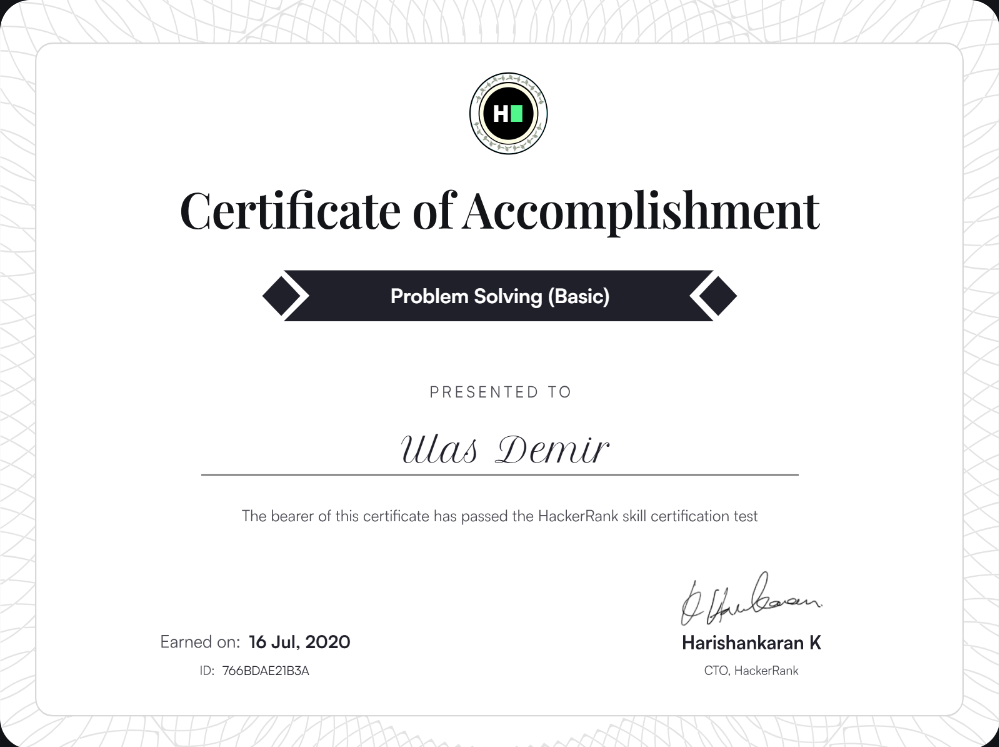

## Hi there, I'm Ulaş 👋

I'm a Full-Stack Developer with 6+ years of experience building scalable, secure and high-performance applications.  
I enjoy solving algorithmic problems and continuously improving myself through hands-on development and learning.

---

### 🛠️ My Technical Toolkit & Skills

I focus on building clean, maintainable and reliable software. Here’s a snapshot of my core expertise:

#### 🌐 Frontend Development
| Skill | Experience/Example |
| :--- | :--- |
| **Angular** | Built enterprise UIs used by 200+ contributors in production |
| **DevExpress** | Created user-friendly interfaces reducing onboarding time by 50% |
| **HTML / CSS / TypeScript** | Delivered features as part of agile full-stack delivery |

#### ⚙️ Backend, API & Databases
| Skill | Experience/Example |
| :--- | :--- |
| **.NET / .NET Core (C#)** | Developed microservices and automation for enterprise systems |
| **REST & SOAP APIs** | Improved response times by 40% in critical services |
| **MSSQL** | Optimized queries for key business applications |
| **Redis** | Reduced data access latency by 70% with caching strategies |
| **Microservices / WCF** | Achieved zero-downtime deployments by modernizing architecture |

#### ☁️ DevOps, Automation & Infrastructure
| Skill | Experience/Example |
| :--- | :--- |
| **Docker & Kubernetes** | Automated deployments, reducing deployment errors by 60% |
| **CI/CD Pipelines** | Accelerated releases by 25% through GitOps practices |
| **API Management** | Managed distributed service environments across teams |

#### 🧪 Test Automation & Quality
| Skill | Experience/Example |
| :--- | :--- |
| **Selenium & Cucumber** | Increased test coverage by 50% with 75+ automated scripts |
| **E2E, Smoke, Regression Testing** | Achieved 99% stability across 10+ projects |

---

### 🚀 What I’m Currently Working On
- Constantly sharpening my skills through **HackerRank** challenges 🧩
- Exploring **architecture best practices** (Clean Architecture, DDD, Event-Driven)
- Building open-source tools for learning and collaboration

---
### 🧩 HackerRank & Competitive Programming

| Problem Solving (Basic) | Angular (Basic) | Software Engineer Intern |
| :---: | :---: | :---: |
|  | [.png)](https://www.hackerrank.com/certificates/bac797ad92c3) |  |

---

### 🧠 “Always Be Learning”
I take pride in keeping up with modern engineering patterns, tools and cloud-native development.

---

### 🧷 Quick Links

  
  
  

---

### 🤝 Open to Collaboration
If anything here interests you, feel free to:
- Open an issue 📝
- Suggest improvements 💡
- Reach out and connect 🔗

Thanks for visiting — happy coding! 🚀

***

<!--
**ulasfe/ulasfe** is a ✨ _special_ ✨ repository because its `README.md` (this file) appears on your GitHub profile.

Here are some ideas to get you started:

- 🔭 I’m currently working on ...
- 🌱 I’m currently learning ...
- 👯 I’m looking to collaborate on ...
- 🤔 I’m looking for help with ...
- 💬 Ask me about ...
- 📫 How to reach me: ...
- 😄 Pronouns: ...
- ⚡ Fun fact: ...
-->
